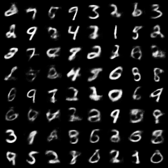

# VAE with Gumbel-Softmax(MindSpore version)

MindSpore implementation of a Variational Autoencoder with Gumbel-Softmax Distribution.


## Dependencies

- Python(>=3.7)
- MindSpore(>=1.7.0)
- Pillow(PIL)
- tqdm

## How to train

### Download dataset

```bash
bash scripts/download_dataset.sh
```

### Training

```
python run.py --epochs 100
```

## Results

```bash
Epoch 1: 100%|█████████████████████████████| 600/600 [00:08<00:00, 67.03it/s, loss=197.744702]
Epoch 1: 100%|█████████████████████████████| 100/100 [00:00<00:00, 139.87it/s, loss=171.156997]
Epoch 2: 100%|█████████████████████████████| 600/600 [00:02<00:00, 201.28it/s, loss=154.225800]
Epoch 2: 100%|█████████████████████████████| 100/100 [00:00<00:00, 227.04it/s, loss=141.676360]
Epoch 3: 100%|█████████████████████████████| 600/600 [00:03<00:00, 198.78it/s, loss=136.877302]
Epoch 3: 100%|█████████████████████████████| 100/100 [00:00<00:00, 212.58it/s, loss=132.565014]
Epoch 4: 100%|█████████████████████████████| 600/600 [00:03<00:00, 198.45it/s, loss=129.608343]
Epoch 4: 100%|█████████████████████████████| 100/100 [00:00<00:00, 200.44it/s, loss=125.751698]
Epoch 5: 100%|█████████████████████████████| 600/600 [00:03<00:00, 199.70it/s, loss=124.039407]
Epoch 5: 100%|█████████████████████████████| 100/100 [00:00<00:00, 227.72it/s, loss=121.459053]
Epoch 6: 100%|█████████████████████████████| 600/600 [00:03<00:00, 196.10it/s, loss=119.661169]
Epoch 6: 100%|█████████████████████████████| 100/100 [00:00<00:00, 227.14it/s, loss=117.138183]
Epoch 7: 100%|█████████████████████████████| 600/600 [00:02<00:00, 200.22it/s, loss=116.419100]
Epoch 7: 100%|█████████████████████████████| 100/100 [00:00<00:00, 219.57it/s, loss=114.314947]
Epoch 8: 100%|█████████████████████████████| 600/600 [00:03<00:00, 198.68it/s, loss=114.038445]
Epoch 8: 100%|█████████████████████████████| 100/100 [00:00<00:00, 239.54it/s, loss=112.420119]
Epoch 9: 100%|█████████████████████████████| 600/600 [00:02<00:00, 200.53it/s, loss=112.153001]
Epoch 9: 100%|█████████████████████████████| 100/100 [00:00<00:00, 214.83it/s, loss=110.952784]
Epoch 10: 100%|████████████████████████████| 600/600 [00:02<00:00, 205.08it/s, loss=110.523366]
Epoch 10: 100%|████████████████████████████| 100/100 [00:01<00:00, 68.32it/s, loss=109.330553]
```

### MNIST
| Training epoch |  Ground Truth/Reconstructions(test)   |    Generated Samples(predict)    |
| ------------- | :-----------------------------: | :---------------------: |
| 1             |   |   |
| 10            |  |  |
| 20            |  |  |
| 50            |  |  |
| 100           |  |  |